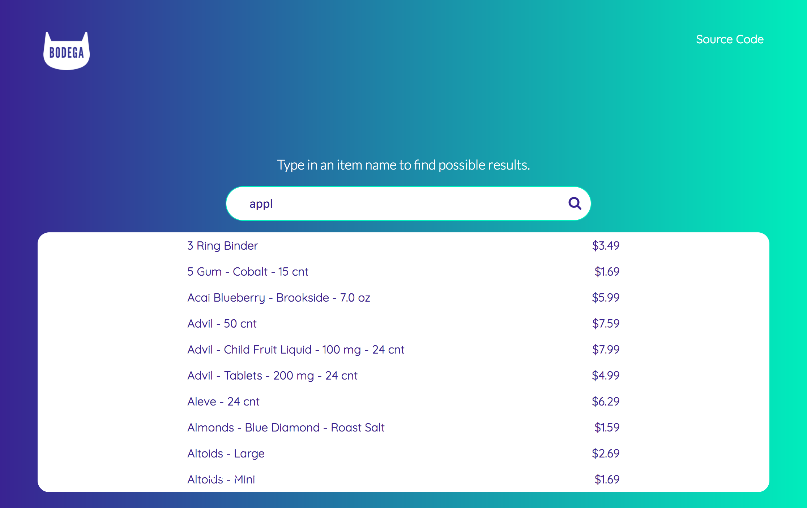
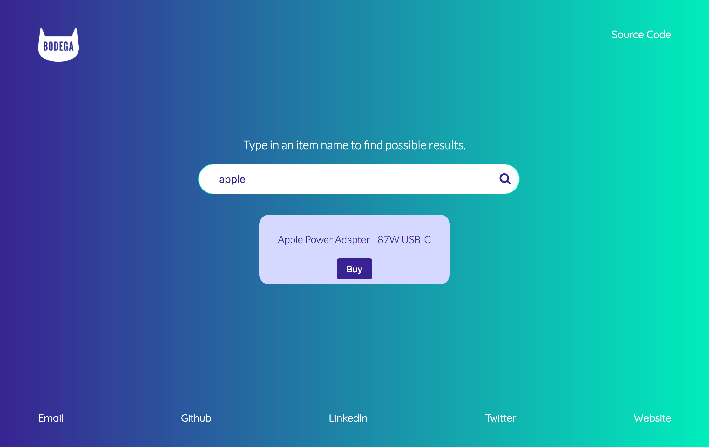

This is a bootstrapped create-react-app focused on an autocomplete component that takes in a user search query and returns possible results from an api.

## Design:
- Simple, responsive UI.
- Clear UX for searching, seeing results, and seeing selected result.

## Logic:
##### Request Parameters & URL:
- The items API lives at [https://www.bodega.ai/api/items](https://www.bodega.ai/api/items).
- It takes in the following parameters:

| Parameter       | Effect |
| --------------- | ------ |
| search          | Limits the results to items with names that match `search`. |
| authorization   | Takes a username and password to check if request is authorized by the API. |

##### These events trigger the request:
- A character is typed into the input field.

##### The server returns back:
- First 10 matches to the search query.
- Count of all matching results.
- URL for getting the next page of results.

#### The UI handles these things:
- Clearing the state and the UI of all results when one result is clicked on.
- Showing the result clicked in a `Card />` component that could be used to show details and handle adding to cart.
- Clearing the selected item when a new search starts in the input field.

## Running Locally:
1. `git clone https://github.com/BeccaSheldon/react-autocomplete.git`
2. `cd react-autocomplete`
3. Update `~/react-autocomplete/src/components/config/CredentialsExample.json` with your credentials and rename the file to `Credentials.json`
3. run `yarn start`

## Screenshots:

## Improvement List:
- Highlight search query in the list of found results.
- Add results count to the list of found results.
- Add ability to view more possibilites in the list of found results (just needs page number update in the api url + pagination UI).
- Handle case when no results are found.
- Cut down number of API calls by requiring three letters before query is considered valid or just waiting half a second for typing to stop (or some other rule).
- Cache results on the client for some amount of time (would also cut down number of requests).
- Add component transitions and fun interactions.
- Improve copy to be more on-brand and more interesting.
- Improve design to be more on-brand.
- Add tests!

#
####  Thanks for taking the time to check out this repo and README!
#